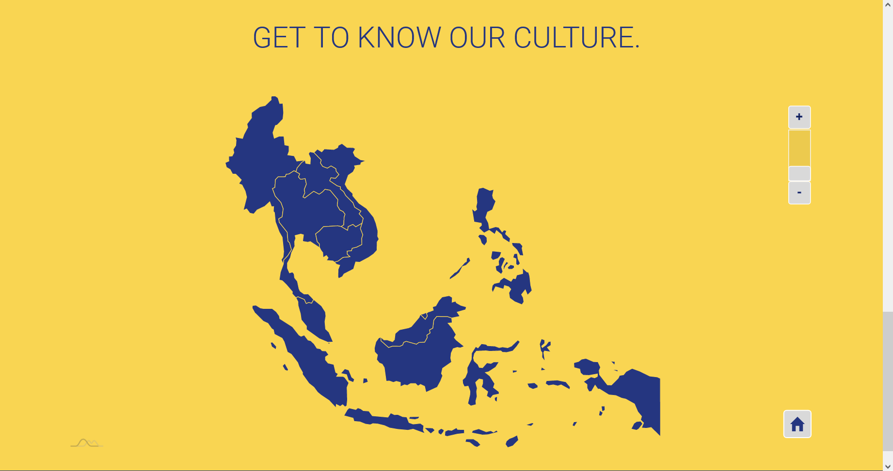

# Website

Website for Understanding The Self a course in CIIT College of Arts
and Technology.

## Build

Just a simple site not including any backend.

JS: [JQuery](https://jquery.com/)\
Animations: [Anime.js](https://github.com/juliangarnier/anime/)\
Maps: [AMCHARTS](https://github.com/amcharts/amcharts4)\
Charts: [Chart.js](https://github.com/chartjs/Chart.js)\
Slides / Carousels: [Splidejs](https://github.com/Splidejs/splide)\
Enter View: [enter-view](https://github.com/russellgoldenberg/enter-view)

## Sample Images

